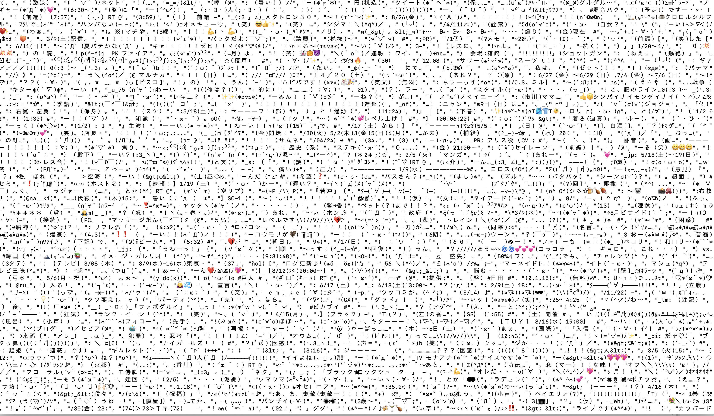
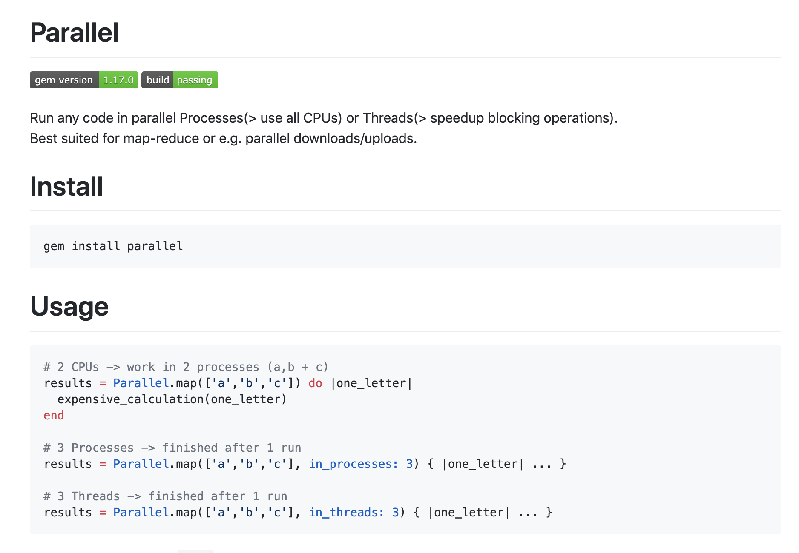

# 顔文字を
# 3万個集める技術

永和亭 色箱
@color_box

---
## 気をつけよう 
## 夏の暑さと 
## 並列処理

色箱

---

# 集めた顔文字

---



---

# 動機

 - 知らないもののことを知りたいし集めたい
 - 収集用のアプリ作成がおもしろそう

---

## 結果
### 約60万の顔文字を収集完了
### ノイズ、重複除去で5%程度残ると推定

---

# 約3万
## の顔文字を収集

`(・3・)b`

---

# 集め方

1. ツイートを集める
2. ツイートから顔文字を抽出する

`(   ‘ᾥ’   )ｼﾝﾌﾟﾙ`

---

## `Twitter`からツイートを集める

---

### ユーザーの収集

 - #### 顔文字紹介アカウントのフォロワー
 - #### 顔文字使用頻度の高いアカウントのフォロワー

顔文字利用者を中心にユーザー収集
ツイートに顔文字が現れる確率が高そう

---

### ユーザーからツイート収集

 - Twitter APIの制約を守りつつ収集用のtaskを回す
 - Parallel gem で並列高速化

`( ＾ω＾ 三 ＾ω＾ )ﾋｭﾝﾋｭﾝ`

---



---

## 暑さと並列実行にCPUがやられる
全CPUを並列実行で酷使すると
電源につないでいてもMBPのバッテリーが減る
`( 🔥ᾥ🔥 )`

---

## データが吹っ飛ぶ
CPUを酷使したせいかmacが吹っ飛ぶ
ついでにSQLiteも吹っ飛ぶ
バックアップは大事
`＼(^o^)／ｵﾜﾀ`

---

## ツイートから顔文字を抽出

---

# 難航
 - 顔文字の定義が曖昧
 - 適切な抽出ルールづくりが難しい

---

## 顔文字に関する論文
 - ググって見つけた論文を元にルール作成
 - Unicodeプロパティによる判別
 - 完璧ではないのでノイズフィルタが必要

---

抽出ロジックはgem化
colobox/kaomoji

---

Usage

```irb 
Kaomoji.get_kaomoji_parts('(・3・)＼(^o^)／ぷにう')
=>["(・3・)＼(^o^)／"]
```

---

フィルタ成功例

```irb 
str = "聴きながら歌うから(*˘ᗜ˘*).｡.:*"
Kaomoji.get_kaomoji_parts(str)
=>["(*˘ᗜ˘*).｡.:*"]


str = "失敗しました_(:3 」∠)_ ハルかわいい(」’ω’)」ｵｫｵｫｵ!!!ｳｳｩｩｱｱｫｵ!!!!!!")
Kaomoji.get_kaomoji_parts(str)
=>["_(:3 」∠)_ ハル", "(」’ω’)」ｵｫｵｫｵ!!!ｳｳｩｩｱｱｫｵ!!!!!!"]

```

---

フィルタ失敗例

```irb 
str = "ザ・下町！！という感じが伝わってきました(≧∀≦)"
Kaomoji.get_kaomoji_parts(str)
=>["ザ・下町！！", "(≧∀≦)"]

str = "それは強いですが、また、悩ましいですね"
Kaomoji.get_kaomoji_parts(str)
=>["、また、"]

str = "中高は行って良かったと思ってる(適当)"
Kaomoji.get_kaomoji_parts(str)
=>["(適当)"]
```

---

### ノイズデータのフィルタ

 - カッコが含まれていない
 - 改行コードが含まれる
 - 明らかにURLの一部
 - 文字列長が極端に短い

などの条件でフィルタ
顔文字の確度を上げる

---

# 集めたデータ数

---

## ユーザー数
# 19,000

---

## ツイート数
# 40,000,000

---

## 抽出した顔文字
# 11,000,000

---

## フィルタにより選別された数
# 630,000

---

## 顔文字数

重複、ノイズを除いておおよそ

# 30,000

`─=≡Σ((( 👍╹ω╹)👍`


---

## 今後

 - フィルタリングの確度向上
 - 顔文字カタログでも作って公開(するかも)

---

### まとめ
- ## 大量データ収集楽しい   `L('ω')┘三└('ω')」`
- ## 古いものには研究と論文があり、読むと捗る
- ## 気をつけよう 夏の暑さと 並列処理


