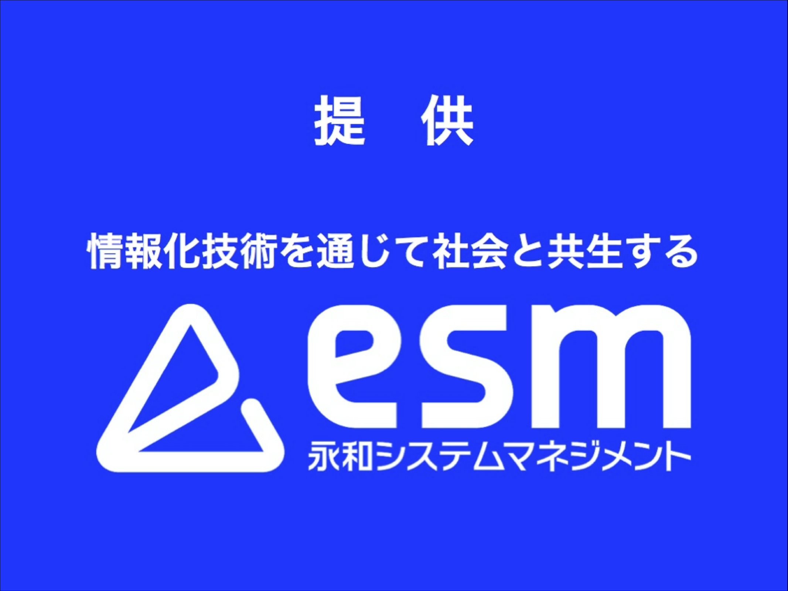

# ESMのご紹介

### Introducing ESM, Inc.

@color_box

---

# いちばん
# 大事なことは

---

# いちばん最初に

---

# We are hiring

---

---

## 自己紹介

@color_box

---

## 会社紹介

### ESM, Inc

- 本社が福井
- 設立は1980年
- 今年で40年目
- 社員数219名

---

## グループ紹介

---

### アジャイル事業部 

- Ruby x Agileグループ
- Rubyの名前を冠するグループ
- 主にRubyによるアジャイル開発をしている
- 所属社員数 23名

---

# 制度紹介

#### カンファレンス参加支援

宿泊費・参加費・交通費の支給

---

# 直近の実績

🇺🇸RailsConf 2019
🇯🇵RubyKaigi 2019
🇯🇵名古屋Ruby会議04
🇹🇼RubyConf Taiwan 2019
🇯🇵富山Ruby会議01

---

# そして

---

🇯🇵RubyWorld Conference 2019

---

# 仕事のやり方

普段の仕事を通して会社紹介をします。

---

# 弊チームの
# 仕事のやり方
# ミーティング編

---

### よく言うフレーズ

- 週に2回のミーティング
- 新機能その他もろもろについて話す
- そこでよく出るフレーズなどについて紹介
- 仕事の空気感・進め方を紹介

---

## 何に使うものですか？

---

## 何に使うものですか？

- 要求された新機能がよくわからなかった時に使う
- 「顧客が本当に必要だったもの」 を引き出す
- 用途/目的を聞くことで代替案を提案できる
- 既存機能の微修正によって実現出来ることが多い

---

## それって必要ですか？

---

## それって必要ですか？

- ビジネスの成長に明白に必要なものと、そうでなさそうなものが混ざって仕様を大きく感じられる時
- 仕様が大きいのは黄色信号

---

## それって必要ですか？

- 大きい仕様は理解が難しい上に、大きな機能になるリスクが高い
- 大きい機能は開発コストや、デプロイ後のメンテナンスコストが上がりがち
- さらに開発から市場までのリリースまでに時間が増大するケースが多い
- まず MVP を考えて、本当に必要な最小限の機能を考える時に使う

---

## それって必要ですか？

- 大きすぎる仕様を削ることで無駄を減らす
- 仕様が小さくなると
- 本質的に必要なものだけを作れる
- デプロイされたコードはメンテナンス対象なので、なるべく小さくシンプルに維持する

### しかも早く作れる

---

## 気をつけるはやめましょう

---

## 気をつけるはやめましょう

- 失敗に対して、最初に「気をつけましょう」が出た時
- 気をつけるだけなのは意味がない
- 仕組化/自動化を行なって本質的な解決ができないかまず考える

---

## 気をつけるはやめましょう

- 普段から全く気をつけていないわけではない
- 本質的な問題を人ではなくシステムとして解決できればベスト

---

## 非同期コミュニケーションで
## できませんか？

---

## 非同期コミュニケーションで
## できませんか？

- 対面のやり取りが無駄に多くなりそうな時
- 緊急を除いてチャットツールやチケット管理ツールなどでの、非同期なやり取りの方がよいケースで提案されたりする

---

## こんな機能があったら
## 嬉しいですか？

---

## こんな機能があったら
## 嬉しいですか？

- 新機能を提案する時に使われるフレーズ
- 開発側から見てあると嬉しそうな機能を提案する

---

## こんな機能があったら
## 嬉しいですか？

- 手動集計を手助けするスクリプト処理など、慣れた開発者が手を動かすと一瞬で終わるが、そうでない人がやろうとすると時間のかかる機能

---

## 使われないものを作っても
## 意味がないのでやめよう

---

## 使われないものを作っても
## 意味がないのでやめよう

- 機能提案する時
- 提案した機能の利用頻度について聞く
- 頻度が低ければ提案を取り下げる
- (Tips) こんな機能があったら嬉しいですか？の後に使われる

---

## 作るのは簡単だが
## メンテコストは高く付く

---

## 作るのは簡単だが
## メンテコストは高く付く

- 新機能について話すときに出るフレーズ
- 往々にして機能追加は簡単だが、メンテナンスコストはその何倍もかかる

---

## 作るのは簡単だが
## メンテコストは高く付く

- メンテコストは雪だるま式に増えていく
- 気をつけないと、開発速度という大事な強みが犠牲になる

---

## 定常業務の自動化

---

## 定常業務の自動化

- 似た依頼が何度か来た時
- データ抽出などの本番作業に対して適用
- 本番作業はエンジニアの手を使う
- エンジニアの手を使わずに行えるようになると、実行コストが下がって効率が良い

---

### まとめ

- チームというミクロ視点からの会社紹介
- 普段の仕事ぶりが伝われば幸いです
- ブースでもっと詳しい話もできます

---

### ブースでお待ちしています

---

### We are hiring

ブースでお会いしましょう
